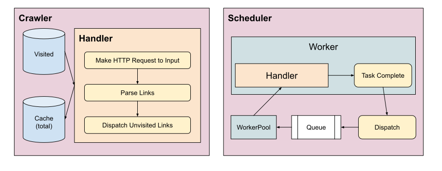

# monzo-techtest
Technical task for Monzo application by Denis Craig

## Problem

### Description

We'd like you to write a simple web crawler in a programming language you're familiar with. Given a starting URL, the crawler should visit each URL it finds on the same domain. It should print each URL visited, and a list of links found on that page. The crawler should be limited to one subdomain - so when you start with *https://monzo.com/*, it would crawl all pages on the monzo.com website, but not follow external links, for example to facebook.com or community.monzo.com.

We would like to see your own implementation of a web crawler. Please do not use frameworks like scrapy or go-colly which handle all the crawling behind the scenes or someone else's code. You are welcome to use libraries to handle things like HTML parsing.

### Assumptions
* Link fragments are ignored, so the following will be treated as the same (there is a flag to disable this behaviour with `-fragments=false`):
  * https://monzo.com/service-quality-results/#personal-great-britain
  * https://monzo.com/service-quality-results/#personal-northern-ireland
* For each page, I'm parsing the direct HTML output. There is no JavaScript execution. This means that SPAs such as React Apps that do no server-side rendering will be unsupported. Any links that are dynamically added to the DOM on the client-side are also unsupported.
* I'm only handling 301 and 302 redirects at the moment.
* I don't consider any sites potential throttling or rate limiting, and just slam requests away. There is a default deadline per worker task of 5 seconds however.


## Solution

### Tools

* Golang v1.21.1
* Docker

### Issues & Possible Improvements
* I could identify the amount of cores on the machine and dynamically determine the amount of worker threads to spin up based on that.
* If I wanted to add a sitemap output, I could generate a tree structure with the initial link provided as the root node.
* There's an issue with the concurrent hash map implementation that causes some kind of address fault. This only seems to happen with a large amount of workers (100+).
* Test suite is quite bare and I'm not reporting coverage. Ideally would add this and get the coverage >80%, but stopped where I got to simply due to time.

### Libraries
* `golang.org/x/net/html` - HTML parsing
* `github.com/fatih/structs` - Converts structs to maps, used lazily to print out CrawlerOptions on
* `github.com/hashicorp/go-hclog` - Structured logging
* `github.com/pterm/pterm` - For fun, live view of worker status and crawl progress (use the `-i` flag when running to see)

## Running the application

### Running locally
```
go run . [args]
```

or

```
go build .
./monzo-techtest [args]
```

### Running as a container
```
docker build -t monzo/webcrawler .
docker run -it monzo/webcrawler [args]
```

### Running tests
```
go test ./...
```

I've also added some "scripts" in the `e2e` folder that serve as benchmark tests, mainly used for testing concurrency by spamming the Monzo website. Sorry :D

Example:
```
./e2e/monzo_all.sh -workers=128
```

## Command-line options
```
  -deadline int
        HTTP request deadline in seconds (default 5)
  -ext string
        Ignore URLs ending in the provided extensions (e.g. jpg)
  -f string
        Output format [stdout|json|xml] (default "stdout")
  -fragments
        Ignore URLs with fragments in their paths (default true)
  -i    Interactive mode
  -json-log
        Enable json logging
  -o string
        Output filename
  -paths string
        Ignore URLs containing the provided strings in their paths
  -url string
        URL to crawl (default "https://crawler-test.com/")
  -v    Enable DEBUG level logging
  -vv
        Enable TRACE level logging
  -workers int
        Amount of worker threads (default 2)
```

### Examples

#### Ignore a list of file extensions
```
./monzo-techtest -url=https://monzo.com -ext=jpg,jpeg,png,svg,gif,svg,mp3,pdf,js,css
```

#### Ignore a list of path parts
```
./monzo-techtest -url=https://monzo.com -ext=help/,blog/,legal/
```

#### Output results to a file in json format
```
./monzo-techtest -url=https://monzo.com -o=monzo.json -f=json
```

#### Debugging large amount of workers
```
./monzo-techtest -url=https://crawler-test.com -vv -workers=128
```

## Architecture

There are 3 main components:
* The `crawler` - Effectively acts as the entrypoint and manager for the program's execution. It defines the handler used by workers in the `scheduler`, handles state with both visited and total links, and ultimately outputting the results of the crawl. It does some other nice things like (somewhat) graceful exit handling, fancy UI updates, and generally acts as the glue for the program.
* The `scheduler` - Manages a pool of workers for multi-threaded execution of a 'handler'. Workers are really just goroutines with some wrapping. The scheduler dispatches new tasks to a queue, and then will invoke those tasks on workers when they become available to consume them.
* The `parser` - Handles all HTTP request handling and HTML parsing. Is mostly treated as a black box in the rest of the program, the `scheduler` has no awareness of it. The `crawler` only cares about it when it comes to defining the task handler.

### Simplified diagram

